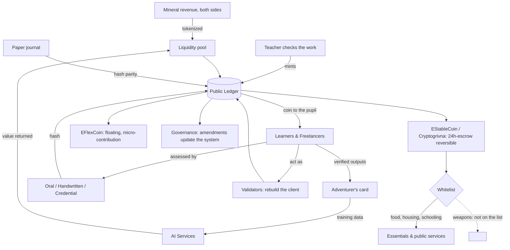

# EduStableCoin: A Knowledge-Backed, Escrow-Reversible Ecosystem for Education, Work, and Governance

**Abstract.** This concept began as an answer to one question: how to stop a war
so that the next one does not start. Its author wrote it while a war was running,
and the mechanism proposed is economic rather than military — pay people, in a
currency that cannot buy weapons, for learning and for work, and the money that
funds aggression stops reaching it. Everything below serves that end.

We describe an open, non-proprietary concept for a decentralized
ecosystem that reframes education, work, and governance around transparency and
human development. A dual-token model pairs a stable, knowledge-backed currency
whose transfers are reversible through a short escrow window, with a light,
floating token for creativity and micro-contribution. Education is restructured as
personalized, freelancing-style learning; its verified outputs both certify the
learner (a portable *knowledge passport*) and help train AI systems, so value
flows back to the people who produce it. An immutable public ledger makes payments
and governance auditable, and AI is used to engage and reward people rather than to
replace them. This document is deliberately open — a blueprint and prompt-set that
any organization may implement on its own compute — and includes a trial-node and
game-integration path so anyone with a laptop can run it.

> **Scope note.** *EduStableCoin* is an open, public concept (a public good, not
> owned by any single company). *Voicy* — referenced here only at a high level as
> an ecosystem product — is a separate proprietary product; its internals are not
> part of this open specification.

---

## 1. Introduction

**The founding aim: stop the war, and stop the next one.** The concept was
written to end an ongoing war and the violence around it, not as a finance
product that happens to touch education. The route it proposes is to fund people
directly instead of negotiating with the power that profits from the war: a
soldier whose family eats does not need the war, and a currency that buys food,
housing and schooling but not weapons moves money out of the fighting without
asking anyone to surrender first.

**The name.** The system is **EduUnity** — *Education Decentralized Unity*. The
syllable also reads as *еду* in Russian and Ukrainian, the dative of food: the
system feeds minds and bodies at once, and the pun is deliberate and trilingual.
Earlier working names (DGES, CryptoEduSys) were discarded by the author as
clumsy. *EduStableCoin*, in the title of this document, is the name of the
currency and of this open specification; *EduUnity* is the system it belongs to.

Three pressures motivate this work: a lack of transparency in public systems and
the misuse it enables; the erosion of learning and critical thinking; and the
economic displacement that AI automation can cause. Purely financial
cryptocurrencies address none directly. We instead treat the ledger as shared
infrastructure for knowledge and coordination — "not only for money" — and design
incentives so that learning, honest work, and transparent governance are the
rewarded activities. The guiding principle is technology in service of people.

**Natural Intelligence (NI).** Where much of the industry races to replace human
work with Artificial Intelligence, this concept is built on the opposite premise:
the human is an extraordinarily efficient *biocomputer* — binocular vision,
on-the-fly reading, an inner voice for reasoning — running on roughly twenty watts.
Humans still outperform silicon at many tasks, at orders of magnitude lower cost.
EduStableCoin treats **Natural Intelligence** as the renewable, valuable resource:
it rewards people for the knowledge and work only they can produce, and uses AI as a
tool in their service rather than a substitute. Learning here mirrors how a model is
trained — a person runs volumes of real work through themselves, improving with each
pass — but unlike a discarded exercise, that work produces real value and pays.

## 2. Dual-Token Model

The currency was named **Cryptogrivna** (криптогривня) in the source discussion,
after the Ukrainian hryvnia, with a crypto-euro as the obvious sibling for a
wider rollout. The technical names below are what the contracts are called; the
money people would hold has a national name, because a currency nobody can name
in their own language is not theirs.

- **EStableCoin** (Cryptogrivna) — a stable currency for education, freelancing,
  and public services. Limited to one transaction per day and **reversible** (see §3), which
  makes it hard to abuse and safer from theft. Its liquidity is grounded in the
  collective knowledge and productive output of its community and is meant to be
  applied to real needs (education, housing, infrastructure, healthcare, ecology).
- **EFlexCoin** — a light, floating token for creativity, tips, and micro-tasks,
  earned via useful AI-training tasks, community engagement, and contribution, with
  no transaction limits. It can bridge to high-throughput chains for liquidity.

## 3. Escrow & Reversibility (the "escrow level")

The distinguishing mechanic of EStableCoin is **escrow-based reversibility**. A
transfer is not immediately final: funds are held in a smart-contract **escrow for
~24 hours** before settlement. Within that window a transaction can be reversed
(e.g. a payment error or a dispute).

- **Safeguards against abuse.** Reversal claims carry penalties for false or
  fraudulent claims, so the window cannot be weaponized.
- **Who approves a reversal.** Reversal within the window is subject to governance
  (nodes / arbiters, see §6) rather than a single central party — automated
  smart-contract checks handle the simple cases; decentralized arbiters handle
  disputed ones.
- **Known trade-offs** (to be tuned): a reversal window introduces some
  centralization pressure and can make recipients cautious until the window closes.
  Comparable prior art includes time-locked escrow (e.g. Ripple Escrow).

**Spending is whitelisted, not forbidden.** An early draft banned military
spending outright; the author rejected his own draft as too explosive — people
read a ban as being disarmed, and they are angry already. What replaces it is
narrower and harder to resent: coins are spendable on food, housing, schooling
and other essentials, and that is all they are spendable on. Nobody is told to
put a weapon down. The money simply does not buy one. *Spend on life, not on
death.*

## 4. Backing: Knowledge and Ground

Because learners' verified outputs can help train AI systems, the value created can
flow back to the people who produced it. This ties part of the currency's backing
to a renewable, non-extractive resource — human knowledge, quantified via
educational outputs — and turns study into fairly compensated contribution.

**The second backing is the ground, and it is the one that stops the war.** The
source concept starts from a concrete proposal: the mineral wealth already on the
table in negotiations (the figure discussed publicly for Ukraine was $500bn) is
tokenized into the liquidity pool instead of being sold off, and the same is done
with the aggressor's resources — oil and gas. It is deliberately two-sided:
revenue that currently funds two war machines is redirected to the people on both
sides of the line. Knowledge alone makes a fine educational currency and stops no
war; the ground is what gives the pool a size worth negotiating over.

**Allocation.** Of the tokenized revenue: **50%** to education contributors
(learners and teachers), **30%** to basic needs (food, housing), **20%** to a
public-treasury pool. A **5% tax at the point of use** funds public services and
loops back into the same ledger, so tax is visible to the person paying it. The
paper ledger mirrors the chain line for line — a treasury nobody can read is the
problem being solved, not the design.

**How much it pays.** The pool pays out of yield and continuing revenue, at a
rate set by what it actually earns. No fixed monthly figure is printed in
advance: a promised amount that the pool cannot cover is worse than an honest
one it can.

**Why not simply copy an existing coin.** Low fees and accessibility are what
matter for a currency people are meant to hold in daily life, and neither
requires a fixed supply. A coin issuing several billion units a year without a
cap is inflationary whatever its reputation says, so the choice here rests on
cost and reach rather than on scarcity.

## 5. Education as Freelancing — Access & Progression

Rather than rigid classrooms, each learner builds a personal knowledge base and
draws from a shared knowledge pool on an approachable social network.

**Access is not gated by an exam.** Anyone may enter and learn freely (accessible
to all). Passing assessments *unlocks* rights and status — earning coins, becoming
a validator, submitting amendments, teaching others, and raising the tier of a portable
**knowledge passport**. Proof-of-knowledge is *progression*, not a wall.

**Three assessment modes**, all designed to resist AI-assisted cheating and to work
on minimal hardware:

1. **Oral** — evaluated in spoken form by an AI tutor, **without a camera**
   (accessible on any device, privacy-preserving; adaptive follow-up questions make
   it hard to game).
2. **Handwritten, not typed** — a photo of handwritten work is read by vision/OCR
   and graded. Typed answers are disallowed (they are trivially copy-pasted from an
   AI); handwriting shows genuine internalization. It is **not** treated as a
   biometric — the card identifies deeds, never bodies.
3. **Credential seeding** — recognized real-world credentials seed the passport
   (e.g. a national passport implies the corresponding language). Each result
   carries the seal of how it was witnessed — alone, before a master, or by
   charter — named for what actually happened rather than for a degree of
   official confidence. Work nobody watched still counts; it is simply read as
   work nobody watched, and the top rank is not reachable on it alone.

Every assessment result is **hashed to the ledger**, making the knowledge passport
verifiable and tamper-resistant (this also realizes the early idea that even a
paper journal can be tracked symbolically via digital hashes).

**The passport is an adventurer's card, not an identity document.** An identity
document answers *who is this person* and proves it with something taken from
their body; this answers *what has this person done* and proves it with the deeds
themselves. Concretely, it carries no name, age, photograph or biometric of any
kind — only ranks per subject, the number of questions each rank rests on, and how
each was witnessed: **alone**, **before a master** (oral or handwritten), or **by
charter** (a seeded credential). This is what makes it safe to show: a card that
carried a body could not be handed to a stranger, and a credential nobody can show
is not a credential. The count of questions is always shown beside the rank, so a
high rank earned on four questions cannot be mistaken for one earned on four
hundred.

**The skill system is modelled on a role-playing game, explicitly.** The source
names Skyrim: skills that advance by being used, visible to the player, with no
gate on which one you train next. That is where the adventurer's card comes from
— it is not decoration over a certificate, it is the shape the author asked for.
Attendance is free in the same spirit: you come to the lessons you want, and you
are paid for knowledge, not for attendance.

**Gamified, productive learning.** Learning is delivered as **quests** and
gamification with **free choice** of subject: quests are real learning and
assessment tasks (playable inside GodotCraft, see §10), experience and levels map to
knowledge-passport tiers, and learners choose their own path from the knowledge
pool. Because each task is real work, practice is never wasted — it simultaneously
produces value (services and AI-training data), pays the learner, and improves them:
a **productive loop** of work → learning → better work → more value. **Teachers**
progress too: basic AI literacy (understanding, at minimum, what a perceptron is) is
a requirement of the teacher tier, so educators grow alongside the tools.

**Minors and custodial earnings.** For under-age participants, activity is framed as
*education*, not labor: minors receive educational rewards, scholarships, and
passport progression rather than wages. Any monetary value accrues in **custodial
escrow** under a guardian (with parental approval), convertible to money only at
legal age or through the guardian; pre-majority, value is held as non-monetary points
and passport tier. (Applicable law varies by jurisdiction; this arrangement is
subject to legal review.)

## 6. Transparent Governance

**Disputes are settled in the form problem → cause → solution (P+C+S).** Every
disagreement, from a graded exercise to a budget, is stated as those three parts
before it is argued, and a moral filter rejects proposals whose motive is one of
the deadly sins. Two effects, both intended by the author: an argument in that
form is already half a lesson in reasoning, and truth outranks headcount —
a well-stated cause does not lose to a badly-stated majority. Simple cases are
settled by smart contract; the ones that need judgement go to human arbiters,
and their rulings are written to the ledger so the reasoning can be audited
later.

An immutable ledger makes payments for education, public services, and taxes
auditable. Governance has **no voting**. There is no ballot, no competing options and no
majority: the single governance action is to **submit an amendment** (a proposal),
and the system **updates** from it. Because the ledger is immutable, an update is a
layer on top — the prior state and the amendment both remain visible, and nothing
is overwritten. Participants act as validators, may mint personalized tokenized
"banknotes," and serve as the arbiters that adjudicate escrow reversals and direct
contradictions between amendments.

**A validator proves the system by rebuilding it.** The qualifying act is not a
stake alone: a validator reassembles the application from source and shows that
what runs is what the source says. Someone who can rebuild it has understood it,
and a system that only its authors can rebuild is trusted rather than verified.
This is why the client is modular and reusable — the design exists so that it can
be taken apart by strangers. The aim is economic
empowerment as a path to more accountable institutions, and to reducing the
conditions (poverty, lack of opportunity, lack of transparency) that drive
instability.

## 7. Consensus & Infrastructure

**A node is a person who speaks a language.** In the source concept the network's
unit is not a machine: a citizen who speaks the language, carries it and can
teach it *is* an infrastructural node — not a cog, but a node, by the fact of
speaking. Phones, PCs, schools and universities carry copies; so does a paper
journal, tracked symbolically through hashes. This is what keeps the network open
to someone with no device at all, and it is the reason the design insists on
paper parity rather than treating it as a fallback.

**Where the money comes from: the notebook is the chain.** Pupils' notebooks form
a sequence of records the way a ledger does. A teacher checking the work *buys*
it — that check is the transaction, and it is what mints the coin. So issuance
runs teacher → pupil: the teacher emits, the pupil receives. It looks like
drawing money out of nothing, and the author answers that himself: it is credit,
a promise that this person will work — with the difference that an AI trained on
that work will be doing part of it. The state thereby funds education,
employment and its own AI with the same act.

The network can be realized as a standalone chain or on a high-throughput base
layer. Design candidates explored: **Proof-of-Stake** (validators stake coins as
collateral — energy-efficient, fast), Delegated PoS, Proof-of-Authority for
trusted consortia, and DAG structures for parallel, feeless confirmation.
Interoperability (e.g. bridging EFlexCoin to a high-throughput chain such as Solana
via a cross-chain bridge) can extend reach and liquidity.

## 7a. Languages as Preserved Infrastructure

Every language of the region goes into one public, cryptographically signed
dictionary — those in daily use and those left only in speech — and every citizen
holds a copy they are morally responsible for keeping. Documents are issued in
three languages so that no one has to give up their own to be understood.

**Nobody is ever made to learn a language** — not English, not Ukrainian, not
Hutsul, which is a language too. The point of putting them all in one book is the
opposite of standardizing them: a language that is written down and signed cannot
be quietly taken away, and the *language question* stops being a reason to fight.
Knowledge and art are kept apart in this store, because they differ in kind:
scientific knowledge is reproducible step by step and can be taught in sequence,
while a poem or a ballad is not reproduced, it is preserved.

## 8. Human-Centered AI Ecosystem

AI engages and rewards people rather than replacing them. Built on these
foundations: **Voicy** (an ambient, privacy-respecting language companion/tutor —
proprietary, referenced only at a high level, and the natural oral/handwritten
assessor of §5); **media & 3D generation** on scalable compute; and an accessible,
**non-violent open-world game** that scales from a "potato" PC to a high-end GPU
with locally-run AI characters.

## 9. System Architecture

*Figure 1. Two things back the currency: verified learning, and mineral revenue
from both sides of the conflict. A teacher checking a pupil's work is the act that
mints a coin. Settlement passes a whitelist — essentials clear, weapons are simply
not a category. A paper journal is a node, not a fallback: it keeps parity with
the ledger by hash.*

## 10. Trial Node, GodotCraft & Accessible Compute

To make the concept tangible for anyone:

- **Trial node.** A public testnet node that anyone can run and inspect.
- **GodotCraft integration.** A worked example of embedding the node into
  **GodotCraft** — an open, Godot-engine voxel game — so a familiar,
  Minecraft-style world becomes a low-barrier on-ramp into the ecosystem (learn,
  earn, and submit amendments from inside the game). *(GodotCraft repository: TBD — link to be
  added.)*
- **Runs on a laptop.** A ready-to-run example on free cloud GPU (e.g. Google
  Colab's ~12-hour GPU sessions), so participants need only a laptop — no dedicated
  hardware — to run a node and reproduce results.

## 10a. The Pilot

The source sets a specific first test, and its point is not that the software
runs. It is that the thing governs: that it taxes, that its books balance, and
that peace is cheaper than fighting — demonstrated small enough to be checked by
hand.

- **Cohort: 100 people** — 50 Ukrainian learners and 50 defectors from the
  aggressor's army. The mix is the test, not a gesture: a system that cannot hold
  both sides at one table does not stop a war.
- **Pool: $1M** of tokenized mineral value, split 50 / 30 / 20 as in §4, with 5%
  taken at the point of use.
- **What is measured:** whether an amendment submitted by a participant actually
  moves the allocation; whether the collected tax rebuilds one real thing (a
  school was the worked example); whether people leave the fighting and stay
  left; and whether validators, rebuilding the client, find nothing.
- **Checked on paper as well as on chain.** Every token, amendment and tax
  written out by hand and matched against the ledger, line for line. If the two
  disagree, the pilot has failed, whatever the software reports.

**On language and pace.** The author asked twice for plain, formal wording:
*airdrop* and its neighbours read as fraud to people who have been defrauded, so
this document says *allocation*. And the intended pace was a year of people
getting used to the system before it carries anything — the war is what compressed
that, not a belief that a year was unnecessary.

## 11. Build Prompt-Set (implementable spec)

This concept is intended to be **built by others on their own compute**. The
following prompt-steps outline an implementation a team can hand to their own AI
tooling:

1. *Contracts* — "Implement `EStableCoin` (one transfer/day per account; transfers
   settle after a 24-hour escrow; a reversal within the window requires an arbiter
   quorum; false-claim penalties) and `EFlexCoin` (unlimited transfers, floating
   supply, mint-on-task)."
2. *Assessment* — "Implement three assessment intakes — oral (speech→grade),
   handwritten (image→OCR→grade), credential-seed (verify→tier) — each emitting a
   signed result hashed to the ledger and raising the knowledge-passport tier."
3. *Passport & rights* — "Build the passport as an adventurer's card: ranks per
   subject with the question count they rest on, and a seal per result (alone /
   before a master / by charter). No personal identifiers of any kind. Gate
   earning/validating/amending/teaching on passport
   tier; keep learning ungated."
4. *Governance* — "Implement validator staking, banknote minting, amendment
   submission that updates system state without a vote, and arbiter adjudication
   for escrow reversals and contradicting amendments."
5. *Node & client* — "Package a testnet node runnable on a free-GPU notebook, plus
   a GodotCraft plugin exposing balances, assessments, and amendments in-game."
6. *Spending whitelist* — "Restrict settlement to whitelisted categories (food,
   housing, schooling, transport, health). Weapons and munitions are not on the
   list. Implement it as an allow-list, never as a ban list — the difference is
   the whole political argument."
7. *Validator rebuild* — "Make the client reproducible from source and require a
   validator to reproduce it as part of qualifying: compare their build against
   the published hash before the stake counts."
8. *P+C+S disputes* — "Model a dispute as problem, cause and solution, three
   fields, each required. Route the simple cases to contract logic and the rest to
   arbiters, and write the ruling and its reasoning to the ledger."
9. *Paper parity* — "Every record must have a printable form whose hash matches
   the chain entry, so a paper journal is a node and not a souvenir."
10. *Languages* — "Ship the public dictionary as signed data, issue documents in
    three languages, and make no language mandatory anywhere in the product."

## 12. Roadmap

1. Whitepaper & open concept (this document + repository).
2. Trial node — public testnet.
3. The 100-person pilot of §10a, checked on paper against the chain.
3. GodotCraft integration + laptop/Colab example.
4. Civic AI service (e-government style) delivered through familiar interfaces.
5. Ecosystem integration (companion tutor, media/3D, open-world game) on shared
   accounts and ledger.

## 13. Principles & Conclusion

Open-source, modular, and reusable; accessible to everyone from engineers to
students; decentralized by design. EduUnity reframes a public ledger as
infrastructure for knowledge and coordination — backing a currency with human
knowledge and with ground that currently pays for war, paying people for the
value they create, and making governance auditable by anyone holding a paper
copy.

The aim it was written for has not changed and should not be softened in the
reading: **stop a war, and leave nothing in place for the next one to grow
from.** Not by asking anyone to lay down arms, but by paying for life directly,
in money that cannot buy the alternative. The author put it plainly, and the
line belongs at the end rather than in a slogan: *it is not about money, it is
about sending a message.*

It is offered openly, as a message and a blueprint. We invite anyone to explore,
question, build, and contribute.
