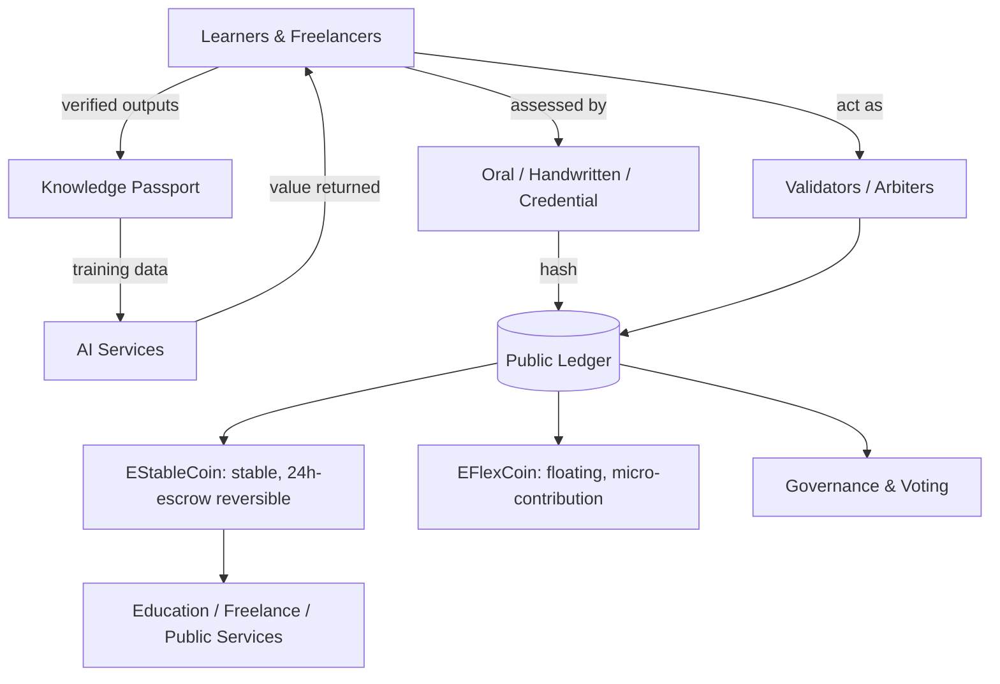

# EduStableCoin: A Knowledge-Backed, Escrow-Reversible Ecosystem for Education, Work, and Governance

**Abstract.** We describe an open, non-proprietary concept for a decentralized
ecosystem that reframes education, work, and governance around transparency and
human development. A dual-token model pairs a stable, knowledge-backed currency
whose transfers are reversible through a short escrow window, with a light,
floating token for creativity and micro-contribution. Education is restructured as
personalized, freelancing-style learning; its verified outputs both certify the
learner (a portable *knowledge passport*) and help train AI systems, so value
flows back to the people who produce it. An immutable public ledger makes payments
and governance auditable, and AI is used to engage and reward people rather than to
replace them. This document is deliberately open — a blueprint and prompt-set that
any organization may implement on its own compute — and includes a trial-node and
game-integration path so anyone with a laptop can run it.

> **Scope note.** *EduStableCoin* is an open, public concept (a public good, not
> owned by any single company). *Voicy* — referenced here only at a high level as
> an ecosystem product — is a separate proprietary product; its internals are not
> part of this open specification.

---

## 1. Introduction

Three pressures motivate this work: a lack of transparency in public systems and
the misuse it enables; the erosion of learning and critical thinking; and the
economic displacement that AI automation can cause. Purely financial
cryptocurrencies address none directly. We instead treat the ledger as shared
infrastructure for knowledge and coordination — "not only for money" — and design
incentives so that learning, honest work, and transparent governance are the
rewarded activities. The guiding principle is technology in service of people.

## 2. Dual-Token Model

- **EStableCoin** — a stable currency for education, freelancing, and public
  services. Limited to one transaction per day and **reversible** (see §3), which
  makes it hard to abuse and safer from theft. Its liquidity is grounded in the
  collective knowledge and productive output of its community and is meant to be
  applied to real needs (education, housing, infrastructure, healthcare, ecology).
- **EFlexCoin** — a light, floating token for creativity, tips, and micro-tasks,
  earned via useful AI-training tasks, community engagement, and contribution, with
  no transaction limits. It can bridge to high-throughput chains for liquidity.

## 3. Escrow & Reversibility (the "escrow level")

The distinguishing mechanic of EStableCoin is **escrow-based reversibility**. A
transfer is not immediately final: funds are held in a smart-contract **escrow for
~24 hours** before settlement. Within that window a transaction can be reversed
(e.g. a payment error or a dispute).

- **Safeguards against abuse.** Reversal claims carry penalties for false or
  fraudulent claims, so the window cannot be weaponized.
- **Who approves a reversal.** Reversal within the window is subject to governance
  (nodes / arbiters, see §6) rather than a single central party — automated
  smart-contract checks handle the simple cases; decentralized arbiters handle
  disputed ones.
- **Known trade-offs** (to be tuned): a reversal window introduces some
  centralization pressure and can make recipients cautious until the window closes.
  Comparable prior art includes time-locked escrow (e.g. Ripple Escrow).

## 4. Knowledge-Backed Liquidity

Because learners' verified outputs can help train AI systems, the value created can
flow back to the people who produced it. This ties the currency's backing to a
renewable, non-extractive resource — human knowledge, quantified via educational
outputs — and turns study into fairly compensated contribution.

## 5. Education as Freelancing — Access & Progression

Rather than rigid classrooms, each learner builds a personal knowledge base and
draws from a shared knowledge pool on an approachable social network.

**Access is not gated by an exam.** Anyone may enter and learn freely (accessible
to all). Passing assessments *unlocks* rights and status — earning coins, becoming
a validator, voting, teaching others, and raising the tier of a portable
**knowledge passport**. Proof-of-knowledge is *progression*, not a wall.

**Three assessment modes**, all designed to resist AI-assisted cheating and to work
on minimal hardware:

1. **Oral** — evaluated in spoken form by an AI tutor, **without a camera**
   (accessible on any device, privacy-preserving; adaptive follow-up questions make
   it hard to game).
2. **Handwritten, not typed** — a photo of handwritten work is read by vision/OCR
   and graded. Typed answers are disallowed (they are trivially copy-pasted from an
   AI); handwriting shows genuine internalization and doubles as a weak biometric.
3. **Credential seeding** — recognized real-world credentials seed the passport
   (e.g. a national passport implies the corresponding language). Trust is tiered:
   self-declared → system-verified → officially-verified.

Every assessment result is **hashed to the ledger**, making the knowledge passport
verifiable and tamper-resistant (this also realizes the early idea that even a
paper journal can be tracked symbolically via digital hashes).

## 6. Transparent Governance

An immutable ledger makes payments for education, public services, and taxes
auditable. Participants act as validators, may mint personalized tokenized
"banknotes," and take part in transparent, decentralized voting — including as the
arbiters that adjudicate escrow reversals and complex disputes. The aim is economic
empowerment as a path to more accountable institutions, and to reducing the
conditions (poverty, lack of opportunity, lack of transparency) that drive
instability.

## 7. Consensus & Infrastructure

The network can be realized as a standalone chain or on a high-throughput base
layer. Design candidates explored: **Proof-of-Stake** (validators stake coins as
collateral — energy-efficient, fast), Delegated PoS, Proof-of-Authority for
trusted consortia, and DAG structures for parallel, feeless confirmation.
Interoperability (e.g. bridging EFlexCoin to a high-throughput chain such as Solana
via a cross-chain bridge) can extend reach and liquidity.

## 8. Human-Centered AI Ecosystem

AI engages and rewards people rather than replacing them. Built on these
foundations: **Voicy** (an ambient, privacy-respecting language companion/tutor —
proprietary, referenced only at a high level, and the natural oral/handwritten
assessor of §5); **media & 3D generation** on scalable compute; and an accessible,
**non-violent open-world game** that scales from a "potato" PC to a high-end GPU
with locally-run AI characters.

## 9. System Architecture

*Figure 1. Learning produces verified outputs, which train AI and return value to
learners; assessments and transfers are recorded on a transparent public ledger,
with EStableCoin settling through a 24-hour escrow.*

## 10. Trial Node, GodotCraft & Accessible Compute

To make the concept tangible for anyone:

- **Trial node.** A public testnet node that anyone can run and inspect.
- **GodotCraft integration.** A worked example of embedding the node into
  **GodotCraft** — an open, Godot-engine voxel game — so a familiar,
  Minecraft-style world becomes a low-barrier on-ramp into the ecosystem (learn,
  earn, and vote from inside the game). *(GodotCraft repository: TBD — link to be
  added.)*
- **Runs on a laptop.** A ready-to-run example on free cloud GPU (e.g. Google
  Colab's ~12-hour GPU sessions), so participants need only a laptop — no dedicated
  hardware — to run a node and reproduce results.

## 11. Build Prompt-Set (implementable spec)

This concept is intended to be **built by others on their own compute**. The
following prompt-steps outline an implementation a team can hand to their own AI
tooling:

1. *Contracts* — "Implement `EStableCoin` (one transfer/day per account; transfers
   settle after a 24-hour escrow; a reversal within the window requires an arbiter
   quorum; false-claim penalties) and `EFlexCoin` (unlimited transfers, floating
   supply, mint-on-task)."
2. *Assessment* — "Implement three assessment intakes — oral (speech→grade),
   handwritten (image→OCR→grade), credential-seed (verify→tier) — each emitting a
   signed result hashed to the ledger and raising the knowledge-passport tier."
3. *Passport & rights* — "Gate earning/validating/voting/teaching on passport
   tier; keep learning ungated."
4. *Governance* — "Implement validator staking, banknote minting, proposal voting,
   and arbiter adjudication for escrow reversals and disputes."
5. *Node & client* — "Package a testnet node runnable on a free-GPU notebook, plus
   a GodotCraft plugin exposing balances, assessments, and voting in-game."

## 12. Roadmap

1. Whitepaper & open concept (this document + repository).
2. Trial node — public testnet.
3. GodotCraft integration + laptop/Colab example.
4. Civic AI service (e-government style) delivered through familiar interfaces.
5. Ecosystem integration (companion tutor, media/3D, open-world game) on shared
   accounts and ledger.

## 13. Principles & Conclusion

Open-source, modular, and reusable; accessible to everyone from engineers to
students; decentralized by design. EduStableCoin reframes a public ledger as
infrastructure for knowledge and coordination — backing a stable currency with
human knowledge, paying people for the training value they create, and making
governance transparent. It is offered openly, as a message and a blueprint. We
invite anyone to explore, question, build, and contribute.
